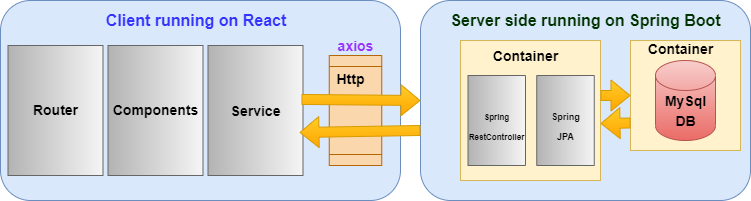

# Hobby Kitchen

-This project is for the course TDDD27 - Advance Web Programming.

# Vision for the project

-This is a web application for an individual who likes to cook for fun. 
Using this application, the chef can post one or more dishes available for ordering for the customers.

-Chef with the admin role, can login and add/update/delete the dish of the day with a description and picture and recipe for the dish.
-Customer with the user role, can look at the dish of the day, brouse the site without logging in. And can place their order after logging in. 
-All the previously posted dishes will be saved and will be visible on the site.

-If time permits, I will aslo add a payment gateway and a comment section for each post.

# Technical Aspects

- Server Side:
    The server side for this application consists of a Spring Boot applicaion with a MYSQL database.
    - Spring version 2.7.0
    - MYSQL version  5.6
    - Build tool     Maven 3.0
    - Hibernate with JPA implementation is used to implement the DAO layer at the backend.
    - The application will consist of REST services which will allow the client to perform CRUD operations on the database.
	- Docker for creating images.
	- Docker Desktop for managing the images and containers.
	-For user authentication, I am using JWT authentication from spring framework.

    The spring boot microservice will be packaged as a jar file.
    The springboot jar file will be then dockerized in order to create an image of the application.
    Image for the MYSQL database will be pulled from docker hub.
    Both thes image will run in two different containers and will communicate via a link.

    Finally, one end point with port 8086 is exposed, which is consumed by the client.

- Client side:
    For the client side, I will use React with Bootstrap CSS.
	Material UI.
	
    The client side will consume the REST endpoints offered by the server side and allow the users to perform CRUD operations on
    the database.

# Architecture

 
 
 # Link To Project Screen cast
	
	https://youtu.be/w0YnO0vB2Vc

# Link To Project Code Screen cast

	https://youtu.be/y0hq1gHBXek
	
# Docker Commands

	-Command to create a docker image: docker build. -t backend (where -t is used to define the name of the image)
	-Command to run the image of MySql database after pulling the image: docker run -p 3307:3306 --name mysql-standalone -e MYSQL_ROOT_PASSWORD=root -e MYSQL_DATABASE=project -e MYSQL_USER=admin -e MYSQL_PASSWORD=root mysql:5.6
	-Command to link the container running the image of the backend with the container running the image of the MySql db: docker run -p 8086:8086 --name backend --link mysql-standalone:mysql -d backend
	-Some basic docker commands:
		docker ps -a
		docker container ls
		docker images
		